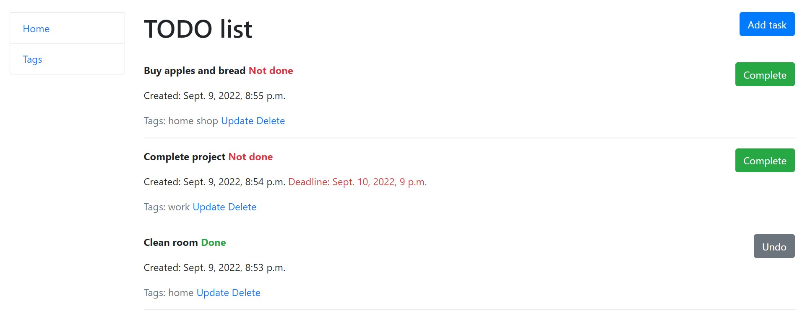
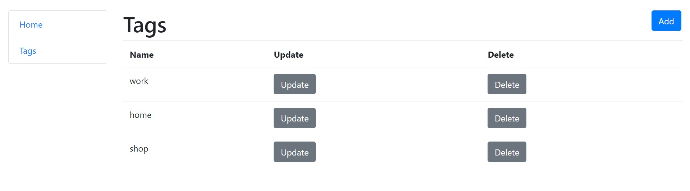

# TODO-LIST
Django To Do App sets you up for success by helping you manage and complete your goals and tasks.

## Check it out!

[ToDo app on Heroku](https://to-do-list-lite.herokuapp.com/)

## Installation

Python3 must be already installed

```shell
git clone https://github.com/denlubn/TODO-LIST.git
python3 -m venv venv
source venv/bin/activate (Linux and macOS) or venv\Scripts\activate (Windows)
pip install -r requirements.txt
python3 manage.py makemigrations
python3 manage.py migrate
python manage.py runserver
```

## Features

* Managing tasks
* Managing tags

## Demo




